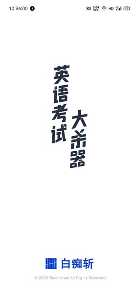
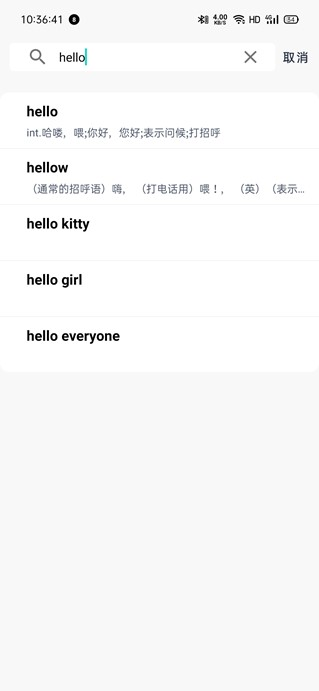
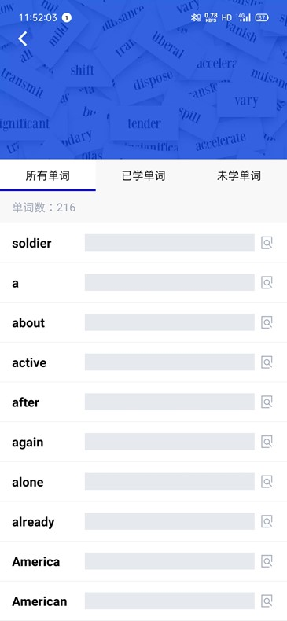
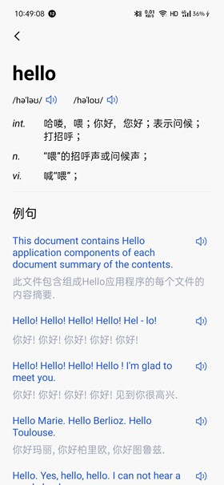
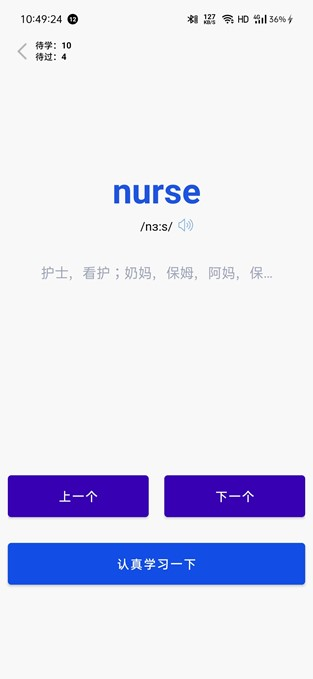
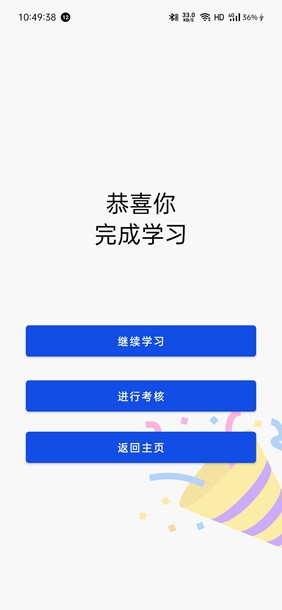
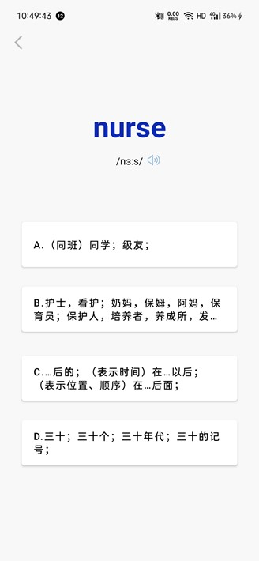

# baichizhan
https://github.com/3448497151/baichizhan
# 白痴斩APP
## 一、项目概述
### 该项目为一个给用户提供英语单词学习的Android APP。
## 二、实现效果  
### 欢迎界面  

    
  
### 开始界面  

    
  
### 搜索界面  

    
  
### 单词界面  

    
  
### 详情界面  

    
  
### 学习界面  

    
  
### 完成界面  

    
  
### 测试界面  

    
  
### 结果界面  

  
